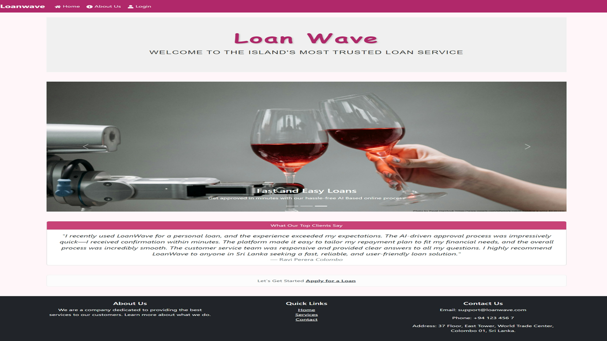
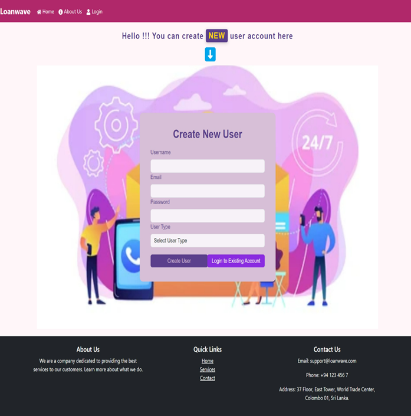
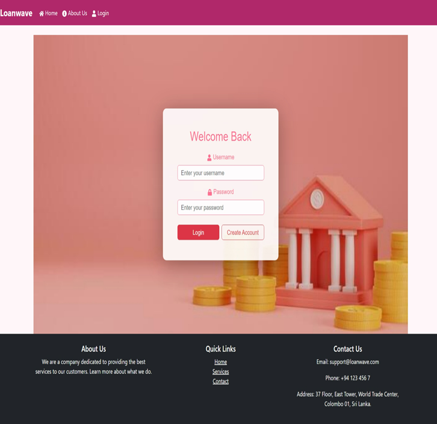
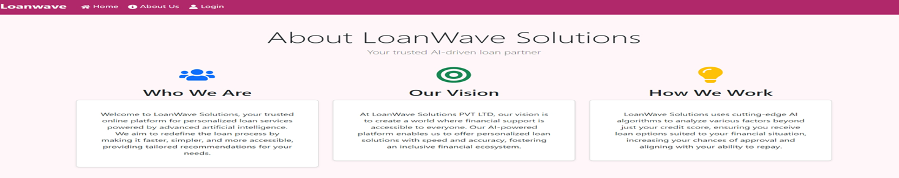
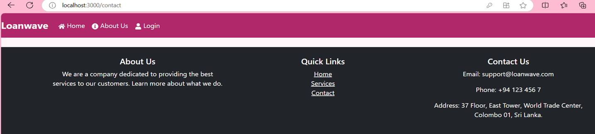
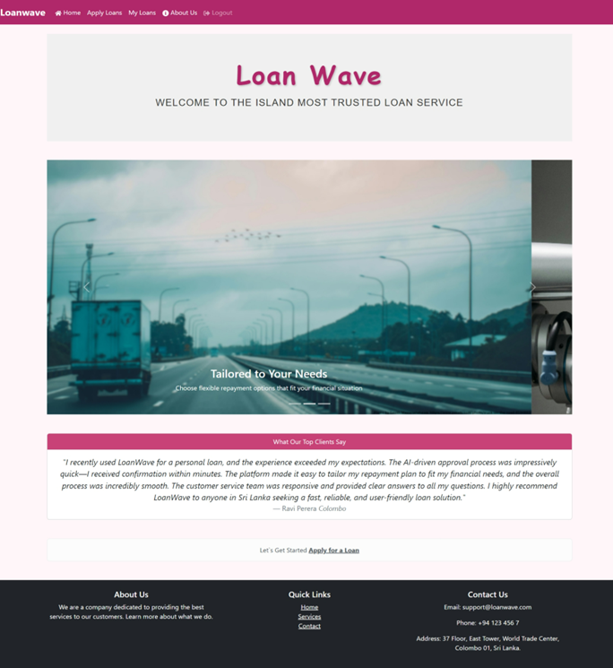
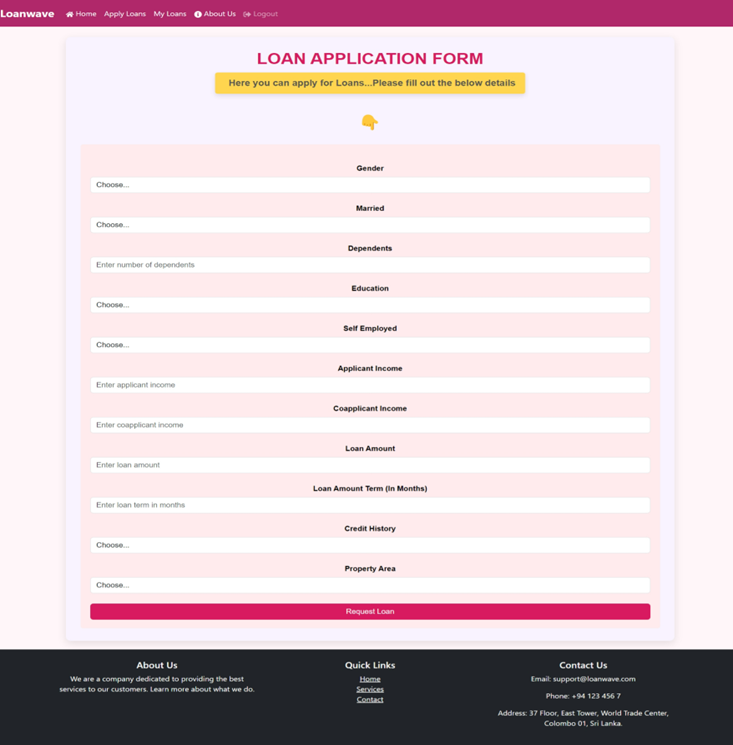
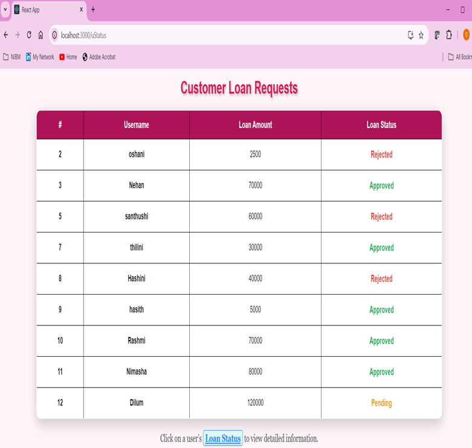
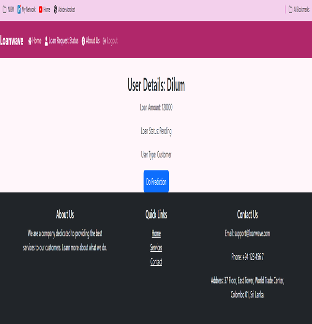
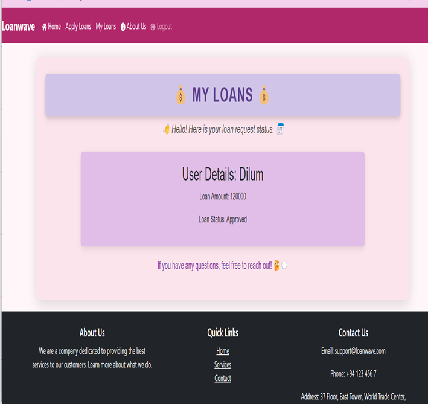

                             LOANWAVE -Loan Status Prediction using Machine Learning
                             
# Getting Started with Create React App

This project was bootstrapped with [Create React App](https://github.com/facebook/create-react-app).

## Available Scripts

In the project directory, you can run:

### `npm start`

Runs the app in the development mode.\
Open [http://localhost:3000](http://localhost:3000) to view it in your browser.

The page will reload when you make changes.\
You may also see any lint errors in the console.
1.Loan Prediction Application Page

2.Create New User - If the user is not a existing user he needs to create a new account

3.Login View - User Can log in to the sysyem

4.About us View - Show detailed information about the company

5.Contact us View - Shows the contact details

6.Here is the customer view

7.Here is the Admin view

8.Admin do prediction

9. Result shown to Customer 

